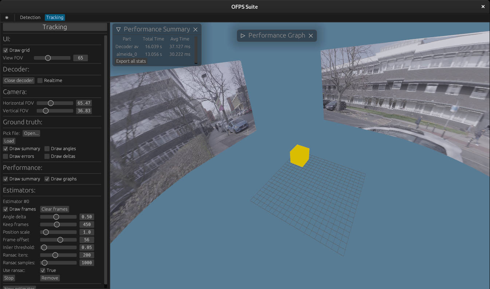

# Optical Flow Processing Stack

OFPS is a generic optical flow processing library, and OFPS Suite is an accopanying app demonstating its functionality.



## Running OFPS Suite

1. Install the latest stable Rust toolchain (version 1.60.0) through https://rustup.rs/.

2. Install dependencies (see dedicated subsection).

3. Build default plugins with `cargo build --release`

4. Optionally, build libmv estimator (more involved, see its subsection).

5. Run OFPS suite with `cargo run --release --bin ofps-suite`

### Installing dependencies

Ubuntu/Debian:

```
sudo apt-get install atk1.0 libgtk-3-dev ffmpeg libavutil-dev libavcodec-dev libavformat-dev libavfilter-dev libavdevice-dev libopencv-dev libclang-dev clang libxcb-shape0-dev libxcb-xfixes0-dev
```

Fedora:

```
sudo dnf -y install https://download1.rpmfusion.org/free/fedora/rpmfusion-free-release-$(rpm -E %fedora).noarch.rpm
sudo dnf install gtk3-devel clang clang-devel opencv-devel ffmpeg-devel
```

Windows/macOS:

Good luck :)

### Building libmv estimator

First, make sure libmv submodule is initialised:

```
git submodule update --init
```

Then, source the environment at the root of the repo

```
source env
```

Then, install extra dependencies:

Ubuntu/Debian:

```
sudo apt-get install cmake libceres-dev libjpeg-dev
```

Fedora:

```
sudo dnf install cmake ceres-solver-devel libjpeg-turbo-devel
```

Go to libmv-rust/libmv directory. Run `make`. Not everything will compile. That is okay - we only need `libmultiview.so` and its dependencies.

Go back to root of the repo, run `cargo build --release --workspace`.

### Troubleshooting

Set log level to see errors better:

```
export RUST_LOG=<trace,debug,info,warn,error>
```

If it is a graphics issue, try forcing OpenGL backend:

```
export WGPU_BACKEND=gles
```

## Documentation

Assuming the workspace compiles, following steps 1-3 of OFPS Suite section, run `cargo doc --open`.

## Unit tests

Assuming the workspace compiles, run `cargo test`.

## Example configurations

Download core samples from [Google Drive](https://drive.google.com/drive/folders/1i4sPhfbvCzV6b0r5iiUEnGVXmX1XkwMq), and extract `samples.zip` (sha256 - c1a27a0716b5633792afca7c1a032dcc9c15c8f7153a03e8d5206e1d86379896) in the project root under `samples` directory. Raw detection sample was large, thus it has been separated into `cctv.h264` file (sha256 - 9fd17d015924538c140f9ee478bdbfc5233f6c948ff134d2f31415e795da9b66). Place it in `samples/detection` directory. Locations are important, because predefined configs reference paths relative to current working directory.

### Detection Configurations

Load predefined configuration files from the paths given (by clicking on the large detection title button).

- Scenario from Results - `samples/scenario_detect.json` (requires raw sample).

- Basic motion - `samples/basic_detect.json`.

- Live TCP stream (webcam) - `samples/tcp_detect.json`.

For V4L webcam through TCP, first run the following command in another terminal:

```
ffmpeg -i /dev/video1 -c:v libx264 -r 30 -preset ultrafast -tune zerolatency -x264-params "" -f mpegts tcp://0.0.0.0:3333\?listen
```

Adjust `/dev/video1` to correct V4L device. The command needs to be re-run after each connection instance.

### Tracking Configurations

Load predefined configuration files from the paths given (by clicking on the large tracking title button).

- Synthetic videos, all estimators, ground truth comparisons - `samples/synthetic_all_gt.json`.

- Synthetic videos, single estimator, ground truth - `samples/synthetic_almeida_gt.json`.

- Real-world videos - `samples/real_world.json`.

- Real-world videos (cropped, slowmo) - `samples/real_world_crop.json`.

- Live TCP stream (webcam) - `samples/tcp_track.json`.

The preloaded samples can be replaced with different ones. See `samples/synthetic` and `samples/real_world` directories. Cropped config is needed to account for 1.2x sensor crop applied on slow motion video.

For TCP configuration, refer to the previous subsection for setup steps. In addition, camera's horizontal and vertical field of view must be set correctly for tracking to be accurate.

